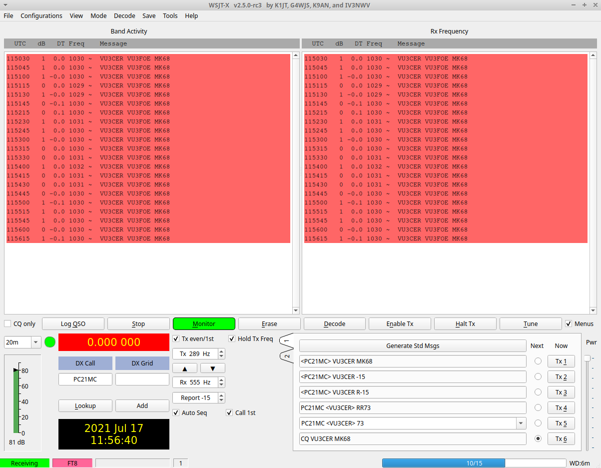
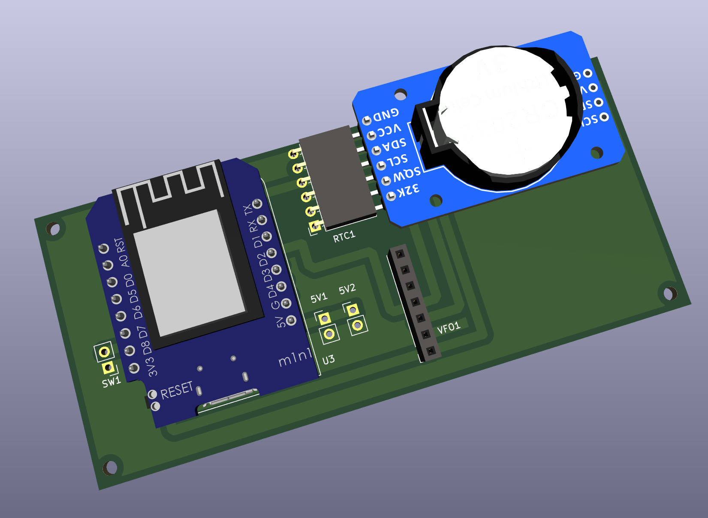
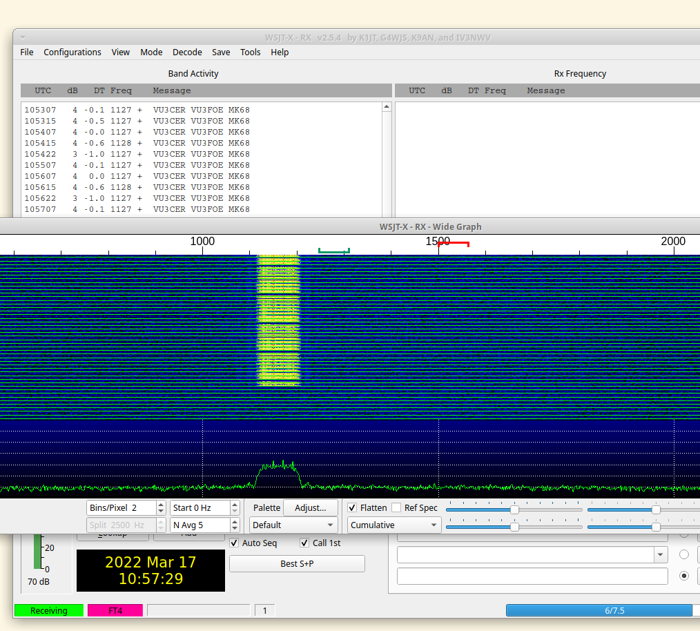
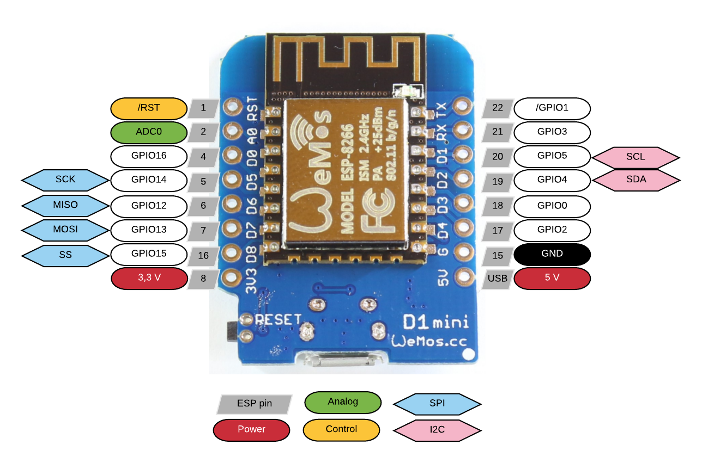
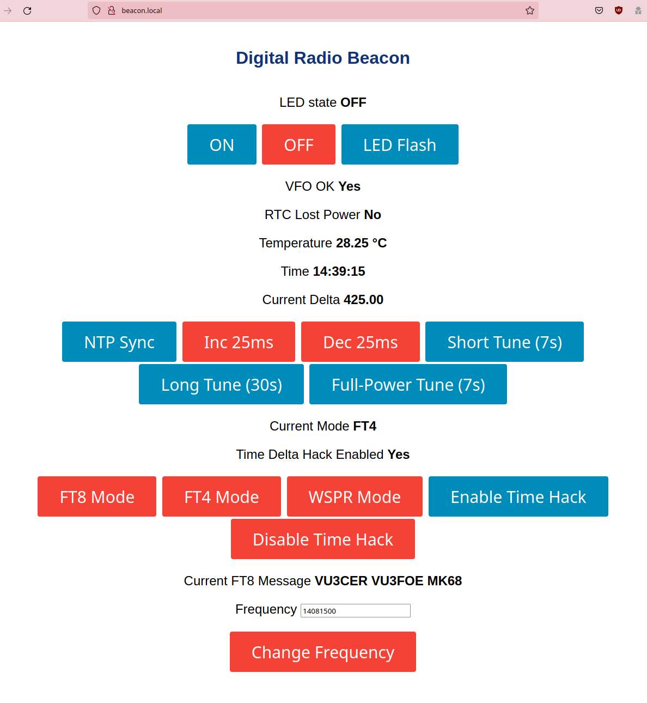
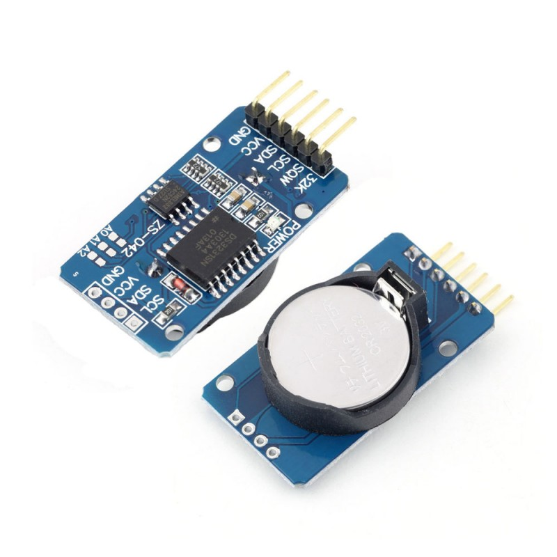
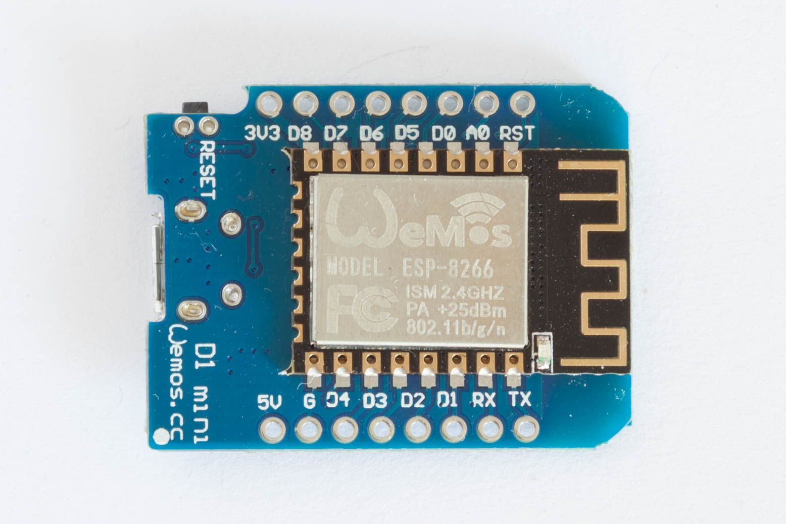
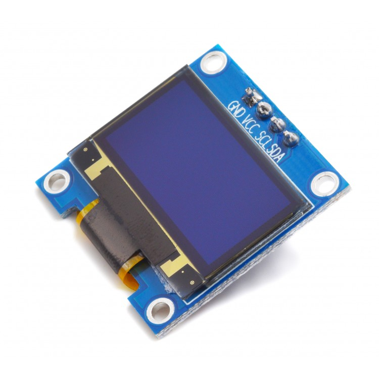

### Easy-Digital-Beacons-v1

A simple and easy WiFi-enabled ESP8266-powered WSPR, FT8, and FT4 beacon system
which uses NTP + DS3231 RTC for timing. Also, checkout our [cost-effective, and
robust HF 5W PA system](https://github.com/kholia/HF-PA-v5/).

It is also a WiFi-enabled VFO, which is quite useful, and convenient for radio
experimentation work.

The whole design is modular, parametric (cost and others), field repairable,
and super extensible. It is almost trivial to add support for more `beacon
modes`.

The `DT` timings are very nice with `NTP Sync`, `DS3231 RTC` and the optional
`time-delta hack`.



WSPR mode demo:


Sample 3D rendering:



Note: This 3D rendering is *only* published to help with the manual layout work
on Zero-PCBs. The current PCB version is just a placeholder hack - more to come
soon!

FT4 mode demo:





Si5351A module is connected via I2C to pins D1 (SCL) and D2 (SDA) of the Wemos
D1 Mini board. Connect DS3231 similarly.

Note: See [this schematic](./Control-Board-Schematic.pdf) for details.

Note 2 (March-2022): The `FT4` beacon is decently reliable now (all thanks to
Anupam).

Note 3: Support for FST4W is not possible with this simple hardware (without
further mods). These mods are explained [on this page](http://www.g4jnt.com/FST4_Beacon_Source.pdf).

We do NOT recommend using the WSPR mode due to its TX duty cycle requirements
at this time.

Author: Dhiru Kholia (VU3CER) - https://www.qrz.com/db/VU3CER/

Author 2: Anupam Saikia - https://github.com/anupamsaikia


#### Build Steps

```
git clone https://github.com/kholia/Easy-Digital-Beacons-v1.git

make install_arduino_cli
make install_platform
make deps  # using Windows?, read the 'Makefile' file

cd ~/Arduino/libraries
git clone https://github.com/me-no-dev/ESPAsyncWebServer.git
git clone https://github.com/me-no-dev/ESPAsyncTCP.git
```

Add your WiFi credentials in `credentials.h` file

Change the following lines in the code to use your values:

```
char message[] = "VU3CER VU3FOE MK68";
char call[] = "VU3FOE";
char loc[] = "MK68";
uint8_t dbm = 27;
```

Change the following line in the code to suit your Si5351A module:

```
int32_t si5351CalibrationFactor =  ...
```

Use [this program](https://github.com/etherkit/Si5351Arduino/blob/master/examples/si5351_calibration/si5351_calibration.ino)
to derive the calibration value for your Si5351A module.

Follow [this tutorial first](https://randomnerdtutorials.com/esp8266-web-server-spiffs-nodemcu/) to
get familiar with `SPIFFS` uploading stuff. Use the `Tools -> ESP8266 Sketch
Data Upload` option in the Arduino IDE to upload the webserver resources to
ESP8266.

Upload the sketch to ESP8266 using the `Sketch -> Upload` option in the Arduino IDE.


#### Usage

Turn off the `SW1` switch, and reboot the beacon system. The beacon system now
connects to your WiFi, and then runs a web server.

This web server can be accessed at http://beacon.local URL typically.

Beacon's web interface:



Use this interface to configure the beacon.

Now, turn on the `SW1` switch, and reboot the beacon system. The beacon system
is active now, and will TX as per the configuration.


#### Notes

This will need a HF RF PA in most cases to be usable on the air.

UPDATE (January 2022): Checkout our [cost-effective, and robust HF PA system](https://github.com/kholia/HF-PA-v5/).


#### Relay Usage

We use a 2-channel relay as a `T/R switch`.

See https://github.com/kholia/Simple-TR-Switch for details.

Also check out https://github.com/kholia/Easy-Transceiver project.


#### BOM

- 1 x 3/5mm LED (purple or pink is recommended)

- 1 x small regular (spst) chassis mount switch

- 1 x 0.25w 470 ohm resistor (CFR / MFR)

- Relimate male connectors

- Relimate female-female cables

- Female berg strips

- Zero PCB of a suitable size

Si5351A Module:


DS3231 RTC Module:



μC Board:



OLED screen:




#### BOM Sources

- https://robu.in/

- https://www.electronicscomp.com/

- https://projectpoint.in/


#### Tips

Useful commands:

```
pacmd load-module module-null-sink sink_name=Virtual0
pacmd update-sink-proplist Virtual0 device.description=Virtual0
pacmd update-source-proplist Virtual0.monitor device.description=Virtual0
```

Use Gqrx and WSJT-X with a SDR device for initial frequency adjustment /
calibration. This is essential for WSPR functionality. FT8 is more
robust/tolerant of frequency deviations due to a much larger RX window.


#### Future Tasks

- Change Si5351 calibration factor from the Web UI

- Add support for custom FT8 / FT4 messages

- Re-announce mDNS stuff [LP]

- EEPROM - save TX interval / schedule [LP]

- Reset to defaults button [LP]


#### References + Credits

- https://github.com/kholia/Easy-Transceiver

- https://github.com/kgoba/ft8_lib

- https://github.com/etherkit/JTEncode

- https://github.com/Naguissa/uEEPROMLib

- https://randomnerdtutorials.com/esp8266-web-server-spiffs-nodemcu/

- https://lastminuteengineers.com/ds3231-rtc-arduino-tutorial/

- https://learn.adafruit.com/adafruit-si5351-clock-generator-breakout/wiring-and-test

- https://github.com/agustinmartino/wsjt_transceiver

- https://github.com/agustinmartino/wsjtx_transceiver_interface

- https://www.qrp-labs.com/synth/ms5351m.html

- https://github.com/anupamsaikia - FT4 fixes - thanks!

- https://github.com/f4goh/WSPR (pretty cool)
